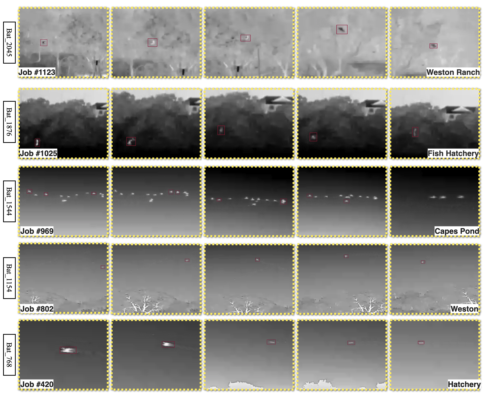
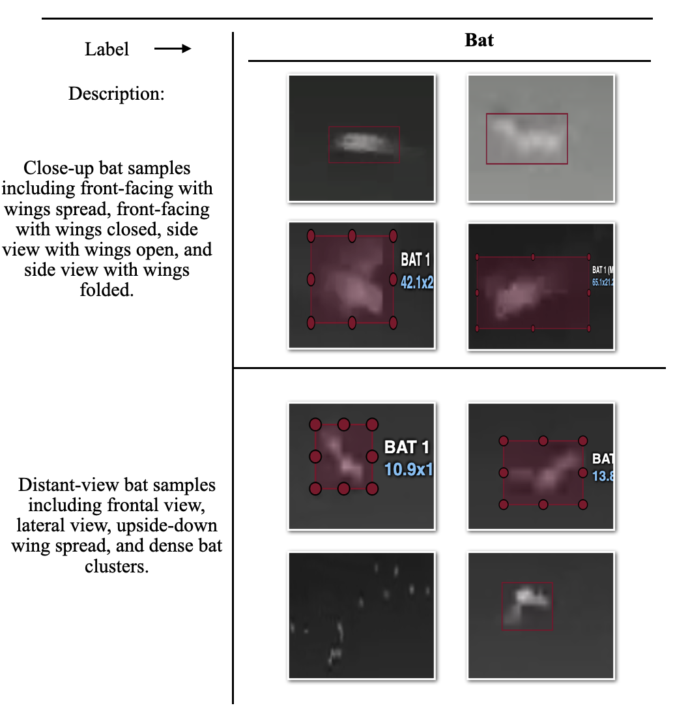
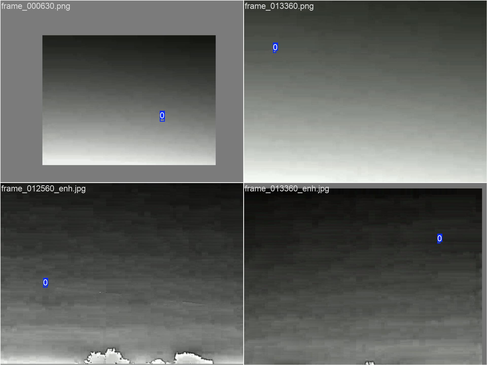
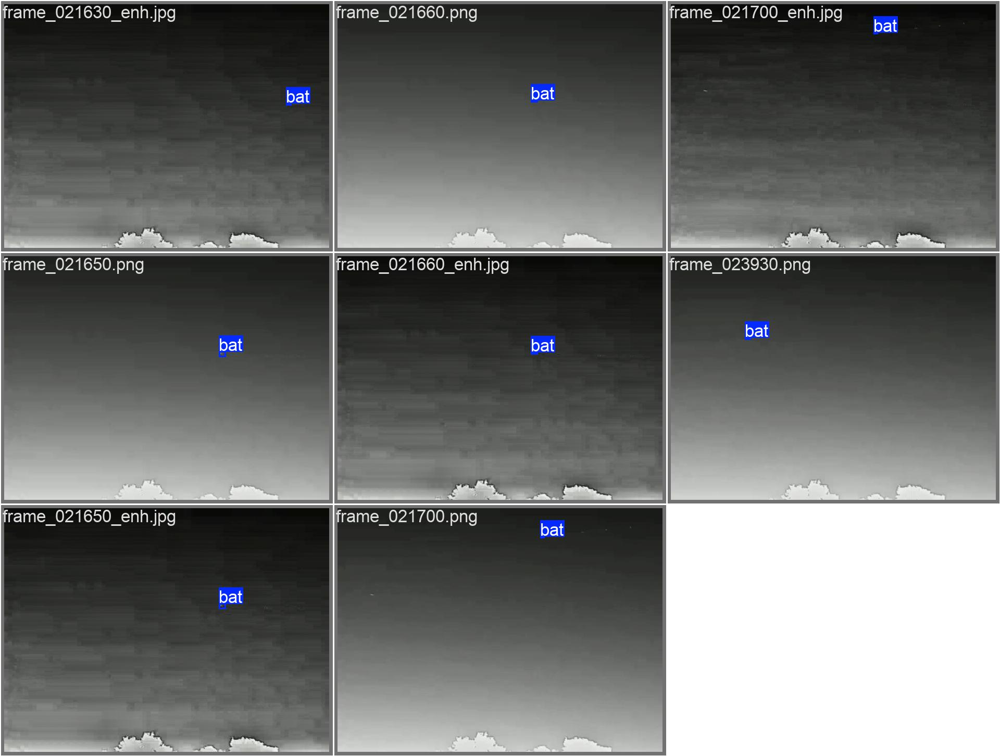
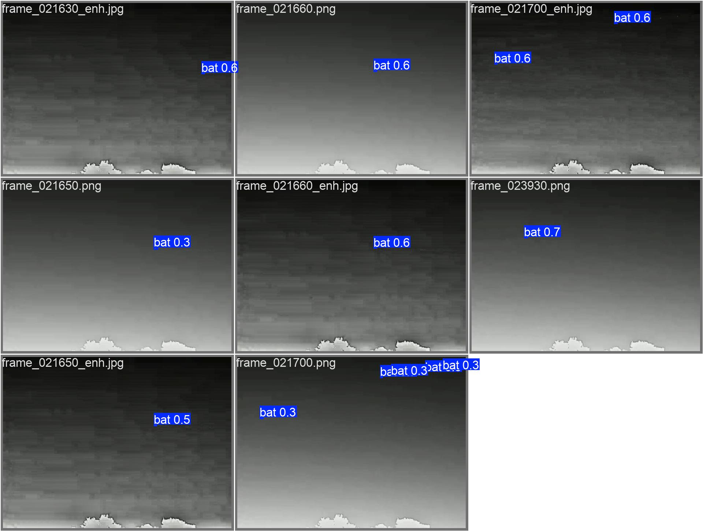

# BAT-SV-2025

Open bat detection dataset with **annotated images (YOLO format)**, **19 raw videos**, and **baseline scripts** (MOG2 + YOLOv8) for reproducible experiments.

---

## Quick Links

* **Dataset (Google Drive):**
  [https://drive.google.com/drive/folders/1Q2BjR5mpYaQoZ7F73QW6Xd7n1Y_hJ88c?dmr=1&ec=wgc-drive-hero-goto](https://drive.google.com/drive/folders/1Q2BjR5mpYaQoZ7F73QW6Xd7n1Y_hJ88c?dmr=1&ec=wgc-drive-hero-goto)

---

## Dataset Contents

The Drive folder contains two zip files:

* **Bat Images.zip** — labeled images for **YOLO object detection**
* **Bat Videos.zip** — **19 raw videos** (unlabeled)

---

## Sample Visualizations

<figure>
  <p align="center">
    <a href="picture/bat_place.png">
      
    </a>
  </p>
  <figcaption>
    <b>Figure 1. Continuous-frame examples (why temporal context matters).</b>
    In many scenes, bats are difficult to recognize from a single frame due to small size, motion blur, and low contrast.
    Using consecutive frames provides stronger evidence for detection.
    The location name shown in the <b>bottom-right</b> of each sub-image corresponds to the recording site.
  </figcaption>
</figure>

<br>

<figure>
  <p align="center">
    <a href="picture/shapebat.png">
      
    </a>
  </p>
  <figcaption>
    <b>Figure 2. Shape diversity examples (viewpoint-dependent appearance).</b>
    Bat appearance varies substantially across different viewpoints and flight poses, leading to diverse shapes and aspect ratios.
    This variability motivates robust detection under orientation and scale changes.
  </figcaption>
</figure>


## Bat Images (YOLO Labeled)

After extracting `Bat Images.zip`, the dataset follows the standard YOLO layout:

```
Bat Images/
  data.yaml
  images/
    train/
    val/
    test/
  labels/
    train/
    val/
    test/
```

### Splits (as reported in the paper)

* **train:** 5010
* **val:** 286
* **test:** 144

> The train split is larger because it includes augmented images.

### data.yaml

* Required for YOLO training (paths + class names).
* You may need to **update the dataset root path** inside `data.yaml` based on your local location.
* Please **do not change** class label names/order.

### Augmented vs. Original Images (optional)

* **Original:** filenames start with `frame...`
* **Augmented:** filenames use prefixes (e.g., `blurred_frame...`, `dark_frame...`)

If you want only original data, filter images starting with `frame...` and keep the matching label files.

### Labels

* YOLO `.txt` bounding boxes under `labels/` (object detection, not segmentation).
* If you need COCO JSON or other formats, convert from YOLO using your preferred tool.

---

## Bat Videos (Raw)

After extracting `Bat Videos.zip`, you will find **19 raw videos**:

* Mostly visible-light recordings; filenames use **location + date**
* Suffixes like `_1`, `_2`, `_3` indicate multiple segments from the same session
* Includes **one infrared video** as an additional cross-sensor test case

> Videos are **unlabeled** and intended for benchmarking, testing trained models, or future labeling.

---

## Training & Validation Snapshots

<figure>
  <p align="center">
    <a href="picture/train_batch0.jpg">
      
    </a>
  </p>
  <figcaption>
    <b>Figure 3. Training batch visualization.</b> Example training batch sampled from the YOLO dataloader.
  </figcaption>
</figure>

<br>

<figure>
  <p align="center">
    <a href="picture/val_batch1_labels.jpg">
      
    </a>
  </p>
  <figcaption>
    <b>Figure 4. Validation batch (ground-truth labels).</b> Visualization of annotated bounding boxes on a validation batch.
  </figcaption>
</figure>

<br>

<figure>
  <p align="center">
    <a href="picture/val_batch1_pred.jpg">
      
    </a>
  </p>
  <figcaption>
    <b>Figure 5. Validation batch (model predictions).</b> YOLOv8 prediction results on the same validation batch for qualitative comparison.
  </figcaption>
</figure>


## Baseline Code (MOG2 + YOLOv8)

This repository includes baseline scripts for:

* **Video inference** with motion gating (MOG2) + YOLOv8
* **Image-set evaluation** with YOLO labels and IoU matching

### Environment

* **Python:** 3.9+
* **Recommended IDE:** VS Code or PyCharm

### Install Dependencies

```
pip install ultralytics opencv-python numpy pandas matplotlib torch
```

> For GPU acceleration, install the CUDA-matching PyTorch build from the official PyTorch site.

### Important: Update Paths Before Running

All scripts currently use **absolute paths** (e.g., `/Users/...`).
Before running, edit each script and update:

* `video_path` / `img_dir` / `label_dir`
* `model_path`
* `save_dir`

---

## Script Overview

### `finaldetect.py` (recommended)

End-to-end **video detection + analysis** pipeline (MOG2 + YOLOv8), designed for reproducible reporting.

* **Motion gating (MOG2)** to decide whether a frame should be analyzed (reduces unnecessary inference).
* **Stride-based triggering**: runs YOLOv8 only every *N* frames (configurable) when motion is present.
* Performs **YOLOv8 inference on triggered frames** and records per-trigger results:

  * timestamp / frame index
  * number of detections (bat_count)
  * confidence statistics (mean / max)
  * optional condition label (e.g., baseline vs. device-enabled)
* Saves **structured outputs** for analysis and paper writing:

  * `detections.csv` (per-trigger records)
  * summary metrics (`video_metrics.txt`)
  * aggregated tables (minute-bin statistics, trends)
* Generates **publication-ready figures** (PNG + PDF), e.g.:

  * histogram of detections per frame
  * minute-level trends
  * cumulative bat-minutes curve (depending on the enabled plotting section)

Recommended when you want **CSV + plots + final metrics** aligned with the paper.

---

### `video_mog2+yolov8.py`

Lightweight **video inference** script for fast qualitative testing and runtime comparison.

* Uses **MOG2 motion detection** to gate inference (only run YOLO when motion is detected).
* Uses a configurable **frame stride** (e.g., every 3 frames) to further reduce compute.
* Writes an **annotated output video** (`annotated_video.mp4`) with predicted boxes and labels.
* Writes a concise runtime summary (`video_metrics.txt`), including:

  * total frames read
  * YOLO triggered frames
  * total detections on triggered frames
  * total / average inference time

Recommended when you mainly need **an annotated video output** plus basic speed statistics.

---

### `yolov8m.py` (training)

YOLOv8 **training script** for this dataset. It provides **two training variants**:

* **Variant A (commented template):** a clean starter template for training `yolov8m.pt` from scratch, with conservative settings (useful if you want a minimal baseline or you already performed offline augmentation). 
* **Variant B (active code):** continues training by **loading a previous `best.pt` checkpoint** and running a new training job with updated hyperparameters and Ultralytics augmentations enabled. 

**Key configurable parameters (edit in the script):**

* `data`: path to `data.yaml`
* `epochs`, `imgsz`, `batch`
* `device`: set to `"mps"` for Apple Silicon acceleration (or `"cpu"` / CUDA device id)
* augmentation knobs such as `mosaic`, `close_mosaic`, HSV jitter (`hsv_h`, `hsv_s`, `hsv_v`), `translate`, `scale`, `fliplr`
* run/output management: `project`, `name`, `save_period`, `patience`, `workers` 

**Important notes:**

* This script currently uses **absolute paths**; you must update them before running.
* The active variant loads `best.pt` as initialization. Since `resume=False`, it **loads weights but does not resume** optimizer/epoch state (i.e., it starts a fresh run initialized from those weights). 

---

### `test_mog2+yolov8m.py`

Image-set **evaluation** script (YOLO labels + IoU matching) for quantitative testing on the labeled split.

* Loads images from `images/test` and GT labels from `labels/test` (YOLO `.txt` format).
* Runs YOLOv8 prediction on each image and matches predictions to GT using an **IoU threshold**.
* Computes standard detection metrics:

  * Precision / Recall / F1
  * average inference time per image
* Saves **annotated images** (predicted boxes drawn) into `save_dir`.
* Outputs a `metrics.txt` summary with counts and final metrics.

Note:

* If your current version forces inference on every image (e.g., `do_infer = True`), then MOG2 is **not used to skip inference** and functions mainly as an optional motion-mask component. If you enable gating, evaluation metrics should account for skipped images accordingly.

Recommended when you need **PR/F1 numbers** on the labeled image test set.

---

## Run Example

```
python finaldetect.py
```

---

## Support

If you have issues accessing the Drive link or downloading the dataset, please open a GitHub issue.

---

